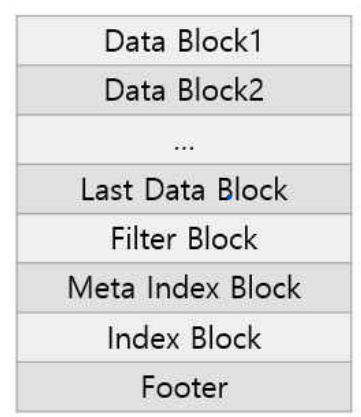
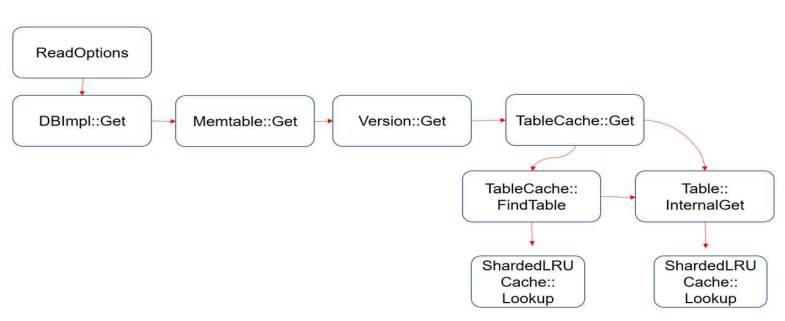
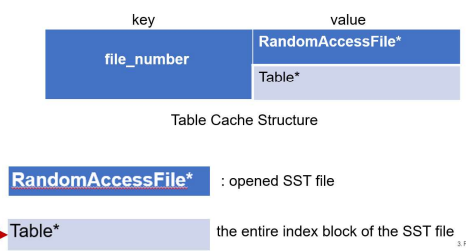
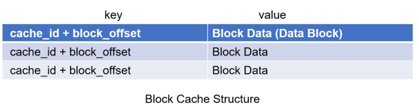
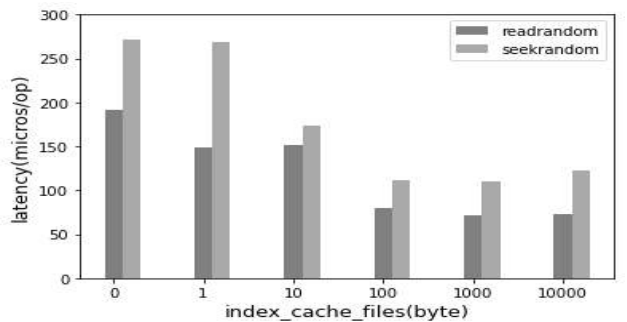
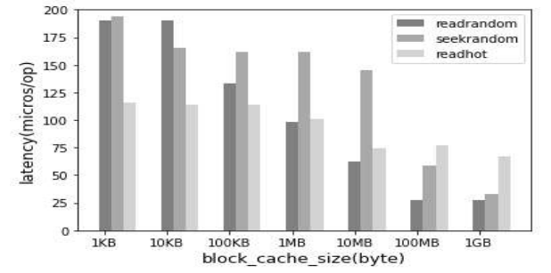

# LevelDB Cache Analysis
[DKU System Software Lab](https://sslab.dankook.ac.kr/)에서 진행한 [2022 LevelDB 스터디](https://github.com/DKU-StarLab/leveldb-study)의 Cache 파트 분석 결과입니다.

본 프로젝트는 Google이 개발한 key-value 스토어 LevelDB의 캐시 메커니즘을 분석하고, 캐시 파라미터 최적화를 통한 읽기 성능 개선 방안을 연구했습니다.

## 프로젝트 개요
**기간**: 2022.07 ~ 2022.12  
**소속**: 단국대학교 System Software Lab  
**성과**: 한국정보과학회(KSC) 2022 학부생 논문 게재 및 포스터 발표

LevelDB는 Google이 개발한 key-value 기반 NoSQL 데이터베이스로, LSM-tree 구조를 사용하여 쓰기 성능을 최적화했습니다. 하지만 계층적 구조로 인해 읽기 성능 저하 문제가 존재합니다. 본 프로젝트에서는 LevelDB의 캐시 메커니즘(인덱스 캐시 & 블록 캐시)을 심층 분석하고, 다양한 워크로드 환경에서 캐시 파라미터 최적화를 통한 읽기 성능 개선 방안을 제시합니다.

## 저자
* 학생: [홍수빈](https://github.com/sss654654)
* 조교: [최민국](https://github.com/korea-choi)
* 선임 조교: [이성현](https://github.com/shl812), [신호진](https://github.com/shinhojin)
* 교수님: [최종무](http://embedded.dankook.ac.kr/~choijm/), [유시환](https://sites.google.com/site/dkumobileos/members/seehwanyoo)

## 목차
### 1. Cache 코드 분석
- [SSTable 구조와 캐시 적용](#sstable-구조와-캐시-적용)
- [Table Cache (인덱스 캐시)](#table-cache-인덱스-캐시)
- [Block Cache (블록 캐시)](#block-cache-블록-캐시)
- [LRU 캐시 구조](#lru-캐시-구조)

### 2. 벤치마크 실험
- [실험 환경](#실험-환경)
- [인덱스 캐시 성능 분석](#인덱스-캐시-성능-분석)
- [블록 캐시 성능 분석](#블록-캐시-성능-분석)

### 3. 연구 결과
- [최적화 가이드](#최적화-가이드)
- [논문 및 발표](#논문-및-발표)

---

## Cache 코드 분석

### SSTable 구조와 캐시 적용

LevelDB는 디스크에 저장된 SSTable(Sorted String Table) 파일에서 데이터를 읽을 때 두 가지 유형의 캐시를 사용합니다.

#### SSTable 구조


*그림 1. SSTable 구조 - 논문의 "그림 1" 참고*

SSTable은 다음과 같은 블록들로 구성됩니다:
- **Data Block**: key-value 데이터 저장
- **Filter Block**: Bloom Filter 저장 (Block Cache에 캐싱)
- **Meta Index Block**: Filter Block의 인덱스
- **Index Block**: Data Block의 인덱스 (Table Cache에 캐싱)
- **Footer**: 48 bytes 고정 크기

#### 읽기 흐름 및 캐시 사용


*그림 2. LevelDB 읽기 흐름 - 논문의 "그림 2" 참고*

LevelDB의 읽기 연산 수행 시:
1. Memtable 검색 (메모리)
2. Immutable Memtable 검색 (메모리)
3. SSTable 순차 검색 (L0 → Ln)
   - Index Block 읽기 → **Table Cache** 체크
   - Filter Block 읽기 → **Block Cache** 체크
   - Data Block 읽기 → **Block Cache** 체크

### Table Cache (인덱스 캐시)



*그림 3. Table Cache 구조 - analysis_Cache_week9.pdf 참고*

- **역할**: SSTable 파일의 Index Block 캐싱
- **키**: `file_number` (SSTable 파일 번호)
- **값**: `Table*` (전체 Index Block 정보)
- **목적**: 디스크 I/O 없이 데이터 블록 위치 빠르게 찾기
- **기본 크기**: 1,000개 (db_bench `--open_files` 옵션으로 조정 가능)

### Block Cache (블록 캐시)



*그림 4. Block Cache 구조 - analysis_Cache_week9.pdf 참고*

- **역할**: SSTable의 Data Block, Filter Block 캐싱
- **키**: `cache_id + block_offset` (파일 ID + 블록 오프셋)
- **값**: Block Data
- **목적**: 자주 접근하는 데이터 블록을 메모리에 유지하여 디스크 I/O 감소
- **기본 크기**: 4MB (db_bench `--cache_size` 옵션으로 조정 가능)

### ShardedLRUCache, LRUCache 구조


LevelDB는 **16-Shard ShardedLRUCache**를 사용하여 멀티스레드 환경에서 효율적인 캐시 관리를 수행합니다.


**핵심 설계**:
```cpp
static const int kNumShardBits = 4;     // 16개 샤드
static const int kNumShards = 1 << 4;   // 16

class ShardedLRUCache {
  LRUCache shard_[kNumShards];  // 샤드별 독립적인 LRU 캐시
};
```

**각 샤드의 자료구조**:
- Hash Table: O(1) 접근
- Doubly Linked List: LRU 순서 관리
- Mutex Lock: 샤드 단위 잠금

**샤딩의 장점**:
- 여러 스레드가 다른 샤드에 동시 접근 가능
- 멀티스레드 환경에서 락 경합 감소 및 성능 향상

---

## 벤치마크 실험

### 실험 환경

| 항목 | 사양 |
|------|------|
| 플랫폼 | Amazon EC2 (t2.micro) |
| vCPU | 1 |
| 메모리 | 1 GiB |
| 스토리지 | EBS |
| Key 크기 | 16 bytes |
| Value 크기 | 100 bytes |
| 데이터 로드 | 100 MB (fillrandom) |
| 읽기 크기 | 1 MB |
| 벤치마크 툴 | db_bench |

### 인덱스 캐시 성능 분석

**실험 조건**:
- 인덱스 캐시 개수: 0 ~ 10,000개 (10배씩 증가)
- 블록 캐시: 4MB (기본값 고정)
- 워크로드: readrandom, seekrandom



*그림 7. 인덱스 캐시 성능 - 논문의 "그림 4" 참고*

**실험 결과**:

| 캐시 개수 | readrandom (μs/op) | seekrandom (μs/op) |
|----------|-------------------|-------------------|
| 0        | ~150              | ~200              |
| 10       | ~80               | ~120              |
| 100      | ~30               | ~50               |
| 1,000    | ~29               | ~48               |
| 10,000   | ~29               | ~48               |

**핵심 발견**:
- 최적 지점: 100개 이상에서 성능 포화
- 이유: 실험에서 생성된 SSTable 파일 개수가 약 100개이므로, 100개 이상의 캐시는 추가 성능 향상 없음
- 권장사항: 예상 SSTable 파일 개수 × 1.2배 정도로 설정

### 블록 캐시 성능 분석

**실험 조건**:
- 블록 캐시 크기: 1KB ~ 1GB (10배씩 증가)
- 인덱스 캐시: 1,000개 (기본값 고정)
- 워크로드: readhot, readrandom, seekrandom



*그림 8. 블록 캐시 성능 - 논문의 "그림 5" 참고*

**실험 결과**:

| 캐시 크기 | readhot (μs/op) | readrandom (μs/op) | seekrandom (μs/op) |
|----------|----------------|-------------------|-------------------|
| 1 KB     | ~50            | ~150              | ~150              |
| 10 KB    | ~48            | ~145              | ~148              |
| 100 KB   | ~45            | ~130              | ~145              |
| 1 MB     | ~43            | ~110              | ~140              |
| 10 MB    | ~42            | ~80               | ~115              |
| 100 MB   | ~42            | ~30               | ~30               |
| 1 GB     | ~42            | ~28               | ~29               |

**워크로드별 특성**:

#### readhot (1% Hot Data 접근)
- Working Set: 매우 작음 (전체 데이터의 1%)
- 성능 특성: 작은 캐시에서도 효과적
- 권장 캐시 크기: 수 MB

#### readrandom (무작위 읽기)
- Working Set: 중간 (전체 데이터에 고르게 접근)
- 성능 특성: 캐시 크기에 비례하여 성능 향상
- 권장 캐시 크기: 수십 MB ~ 수백 MB

#### seekrandom (Iterator 기반 탐색)
- Working Set: 큼 (모든 레벨 탐색 필요)
- 성능 특성: 10MB 이상부터 급격한 성능 향상
- 권장 캐시 크기: 수백 MB 이상

---

## 최적화 가이드

### 인덱스 캐시 설정
```
권장 인덱스 캐시 개수 = 예상 SSTable 파일 개수 × 1.2
```

**예시**:
- 100MB 데이터 → 약 100개 SSTable → 120개 캐시
- 1GB 데이터 → 약 1,000개 SSTable → 1,200개 캐시
- 10GB 데이터 → 약 10,000개 SSTable → 12,000개 캐시

### 블록 캐시 설정

**워크로드 패턴에 따른 설정**:

| 워크로드 패턴 | 특징 | 권장 캐시 크기 |
|-------------|------|--------------|
| Hot Data 중심 | 특정 데이터 반복 접근 | 작음 (수 MB) |
| Random 접근 | 고르게 분산된 접근 | 중간 (수십 MB) |
| Sequential Scan | Iterator 사용, 전체 탐색 | 큼 (수백 MB) |

**결정 공식**:
```
최적 블록 캐시 = min(
  Working Set Size × 1.5,
  Available Memory × 0.3
)
```

### 샤딩이 성능에 미치는 영향
- 16개 샤드로 분산 → 멀티스레드 환경에서 락 경합 최소화
- 각 샤드별 독립적인 Mutex → 동시 접근 가능
- 단일 LRU 캐시 대비 멀티스레드 읽기 성능 대폭 향상

---

## 논문 및 발표

### 논문
- **제목**: LevelDB 캐시 구조 및 성능 분석
- **저자**: 홍수빈, 최민국, 유시환, 최종무
- **학회**: 한국정보과학회(KSC) 2022 학부생 논문
- **다운로드**: [논문 PDF](./papers/최종본LevelDB_캐시_구조_및_성능_분석.pdf)

### 포스터 발표


*그림 9. 포스터 발표 - KSC 2022 제주도*

- **일시**: 2022.12.19 ~ 2022.12.22
- **장소**: 제주도 라마다 프라자 호텔
- **학회**: KSC 2022 동계학술대회

### 발표자료
- [캐시 분석 상세 PPT](./papers/analysis_Cache_week9.pdf)
- [스터디 발표자료](./papers/formatleveldb_study_ppt_2.pdf)

---

## 관련 링크

### DKU-StarLab LevelDB 프로젝트
- [LevelDB Wiki (전체)](https://github.com/DKU-StarLab/leveldb-wiki) - 전자책: [sslab.dankook.ac.kr/leveldb-wiki](https://sslab.dankook.ac.kr/leveldb-wiki/)
- [LevelDB Study (2022)](https://github.com/DKU-StarLab/leveldb-study)
- [Cache 벤치마크 분석](https://github.com/DKU-StarLab/leveldb-wiki/blob/main/benchmarks/cache.md)
- [YCSB Tuning - Cache팀 레포트](https://github.com/DKU-StarLab/leveldb-wiki/blob/main/tuning/%5BTuning%5Dteam_cache_report.md)

### 참고 자료
- [LevelDB 공식 문서](https://github.com/google/leveldb)
- [DKU System Software Lab](https://sslab.dankook.ac.kr/)

---

## 기술 스택

```
Language: C++ (LevelDB 소스코드 분석)
Database: LevelDB, LSM-tree
Tools: db_bench, YCSB-cpp
Concepts: LRU Cache, Sharding, Bloom Filter, SSTable
Platform: AWS EC2
```

---

## 수상 및 지원

본 연구는 다음 기관의 지원을 받아 수행되었습니다:

- 과학기술정보통신부/정보통신기획평가원 SW중심대학사업 (2017-0-00091)
- 과학기술정보통신부/정보통신기획평가원 (No.2021-0-01475)
- 한국연구재단 중견연구자지원사업 (No.2022R1A2C100605011)

---

## 참고문헌
#### 1. Documents
- [LevelDB Document](https://github.com/google/leveldb/blob/main/doc)
- [RocksDB Wiki](https://github.com/facebook/rocksdb/wiki)
- [Jongmoo Choi,『Key-Value Store: Database for Unstructured Bigdata』, 2021](https://github.com/DKU-StarLab/leveldb-study)
- [Fenggang Wu, 『LevelDB Introduction』, 2016](https://www-users.cselabs.umn.edu/classes/Spring-2020/csci5980/index.php?page=presentation)

#### 2. Previous Study
- [DKU RocksDB Festival, 2021](https://github.com/DKU-StarLab/RocksDB_Festival)
- [DKU LevelDB Study, 2022](https://github.com/DKU-StarLab/leveldb-study)


---
